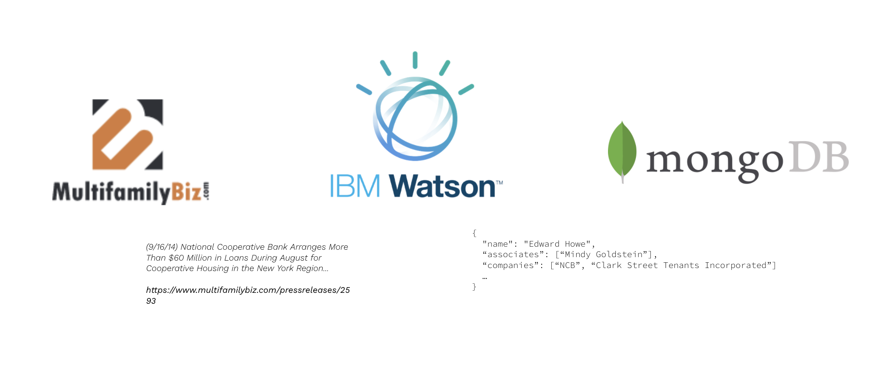

# Watson NLU for Real Estate PR Extraction

Who are the most active real estate actors? Who is making deals with who? On what? For how much?

Real estate transactions, be it an acquisition, construction, value-add, even just straight refinances often are accompanied by a press release. Most often, these press releases will usually contain the people, company, asset, transaction type and dollar amount of the transaction.

Here we scrape thousands of press releases and create a network of who is doing what deals with who, using [Watson's Natural Language Understanding API](https://www.ibm.com/cloud/watson-natural-language-understanding).

## Installation

`npm install`

You'll also need to [obtain IBM credentials](https://cloud.ibm.com/docs/watson?topic=watson-iam). Save the credentials by going to your IBM Console > App > Manage > Download Credential. Save this as `ibm-credentials.env` in this directory.

We use MongoDB as our store. Make sure you have a local instance of mongo running. Then create a DB to hold the results of this scrape by using the following command in the MongoDB CLI:

`use watsonDB`

This will create the watsonDB for you.

## Running the Scrape

MF Biz has a very simply url schema, `/pressreleases/{n}`. The articles each have an incremented `n`, allowing us to simply go to `/10`, `/9`, `/8`...

*Note: as of recent, MF Biz has changed some of their URL scheme. This will require some more work to get this back up and running.*

If we want to scrape articles between `/0` and `/6000`, we would run:

`npm run start -- --0 --6000`

The first set of `--` is important. The first arg is your low index and the second arg is the high. The scrape starts with the most recent (the high arg) and decrements all the way down until the low index or zero. 